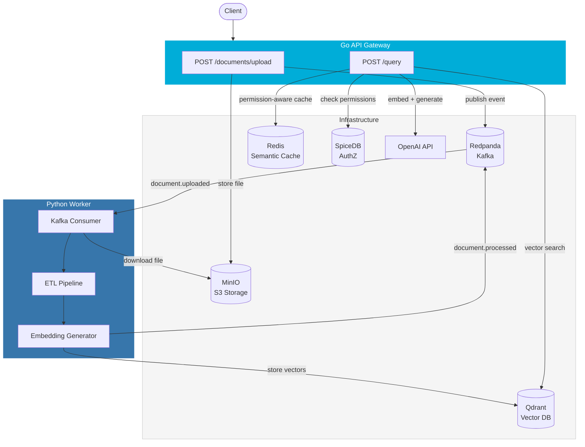
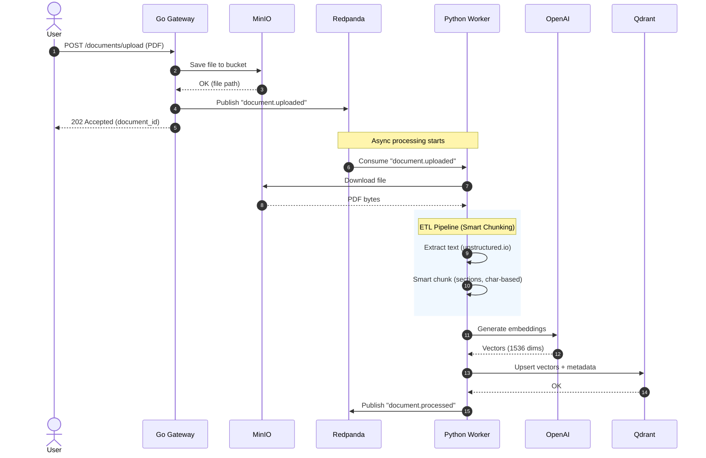
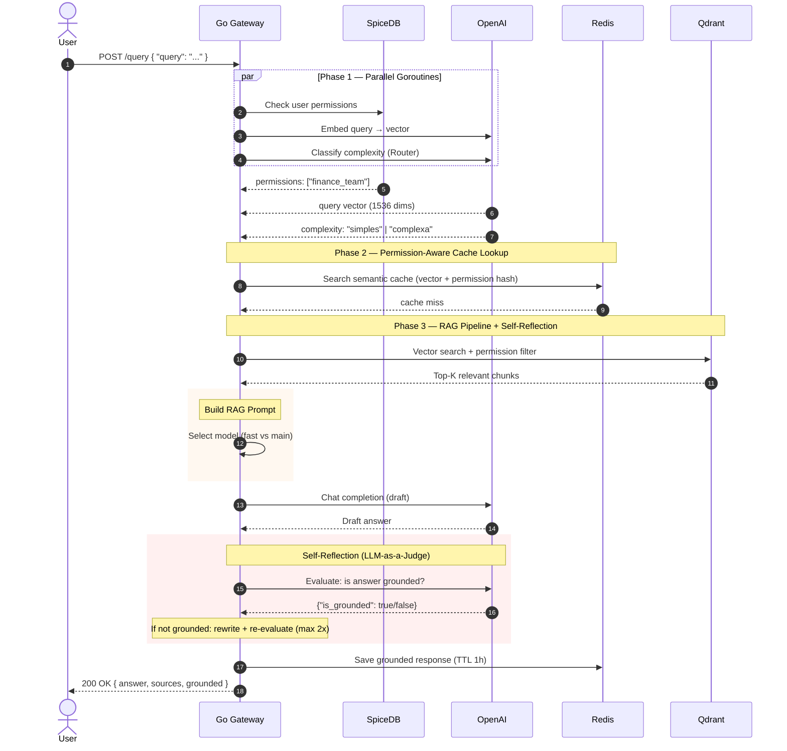
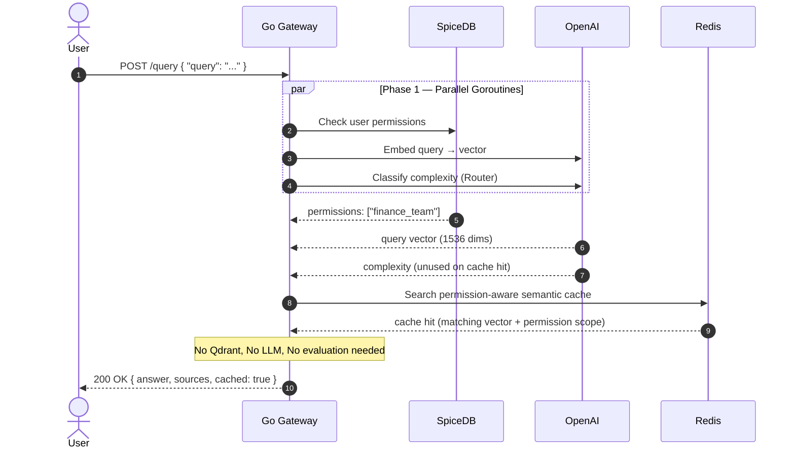
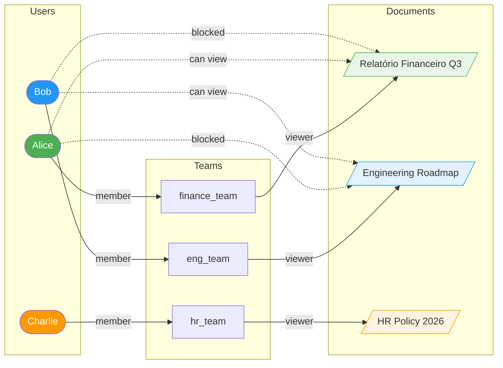
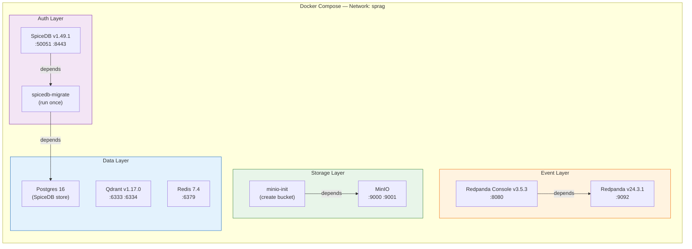

# SP-RAG Architecture Diagrams

## 1. System Overview (High-Level)

---

## 2. Ingestion Flow (Async — Upload to Vectors)

---

## 3. Query Flow (Sync — Question to Answer)

---

## 4. Query Flow — Cache Hit (Fast Path)

---

## 5. SpiceDB Permission Model

---

## 6. Infrastructure (Docker Compose)

---

## 7. Project Roadmap
